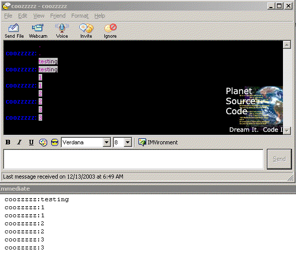



## Attach onto Yahoo\! Messenger's Chat/IM MSHTML events

### Description

Attaching onto the events of the HTMLDocument for Chat/IM windows allows you to accomplish alot when remembering that this also allows you to modify the HTMLDocument as you wish. Example provides real-time events on when new messages are displayed in the chat/im window as well as the ability to change background color and image of that same window. Alot of possibilities but only a few shown.
 
### More Info
 

             |
---                |---
**Submitted On**   |2003-12-13 06:51:50
**By**             |[coozzzzz](https://github.com/Planet-Source-Code/PSCIndex/blob/master/ByAuthor/coozzzzz.md)
**Level**          |Intermediate
**User Rating**    |5.0 (10 globes from 2 users)
**Compatibility**  |VB 6\.0
**Category**       |[Internet/ HTML](https://github.com/Planet-Source-Code/PSCIndex/blob/master/ByCategory/internet-html__1-34.md)
**World**          |[Visual Basic](https://github.com/Planet-Source-Code/PSCIndex/blob/master/ByWorld/visual-basic.md)
**Archive File**   |[Attach\_ont16832612132003\.zip](https://github.com/Planet-Source-Code/coozzzzz-attach-onto-yahoo-messenger-s-chat-im-mshtml-events__1-50433/archive/master.zip)

